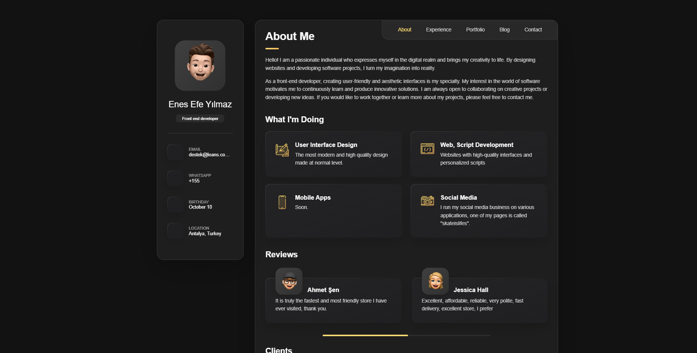
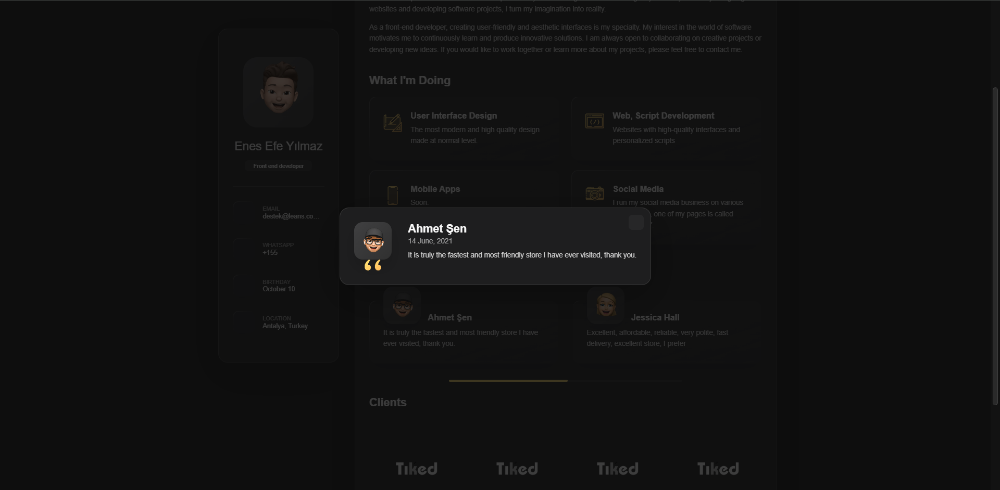
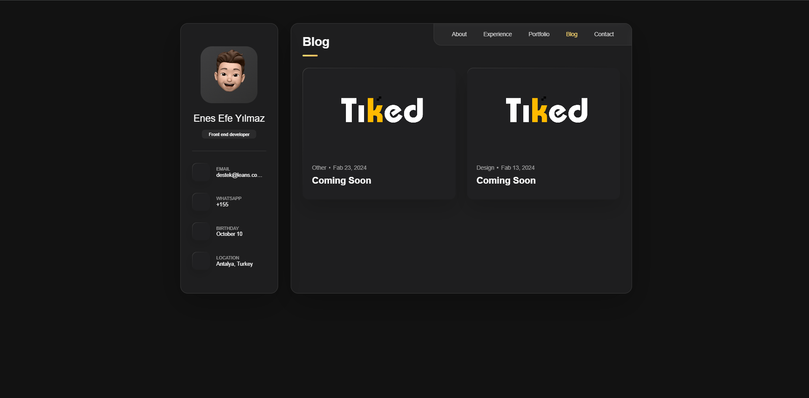
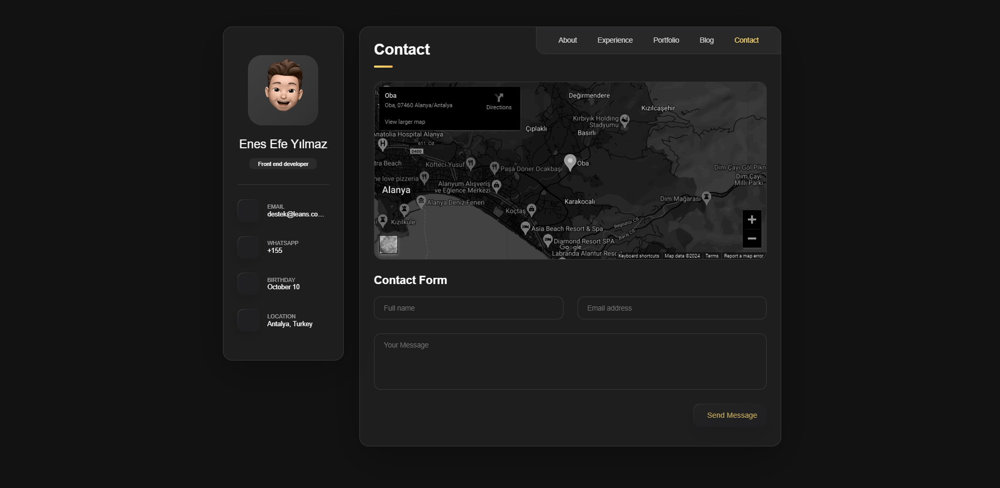

# Kişisel Portföy Web Sitesi

Bu proje, kişisel portföyümü sergilemek amacıyla oluşturulmuş bir web sitesidir. Web sitesi, kullanıcı dostu ve modern bir tasarıma sahiptir. Sitede aşağıdaki bölümler yer almaktadır

- About: Kısaca kendim hakkında bilgi verdiğim bölüm.
- Experience: İş tecrübelerim ve kariyerim boyunca elde ettiğim deneyimleri paylaştığım bölüm.
- Portfolio: Tamamladığım projeleri ve çalışmalarımı sergilediğim bölüm.
- Blog: İlgi alanlarım, uzmanlık alanlarım ve çeşitli konular hakkında yazılar yazdığım bölüm.
- Contact: Benimle iletişime geçmek isteyenler için iletişim bilgilerimin yer aldığı bölüm.

## Özellikler

1. Modern ve kullanıcı dostu arayüz
2. Duyarlı tasarım (Responsive Design)
3. Kolay gezinme ve erişilebilirlik
4. Özel scriptler ile kolaylaştırılmış kullanım

## Kurulum

1. Bu projeyi klonlayın:
    ```sh
    git clone https://github.com/leansvia/blog-portfoli-web-site
    ```

2. Proje dosyalarını bir web sunucusuna veya tarayıcınızda açın:
    - `index.html` dosyasını bir web tarayıcısında açın.

## Lisans

Bu proje MIT Lisansı altında lisanslanmıştır. Daha fazla bilgi için LICENSE dosyasına bakabilirsiniz.





